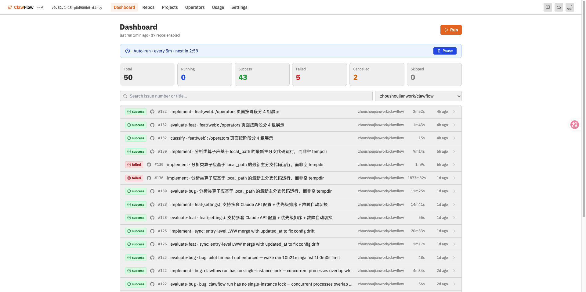
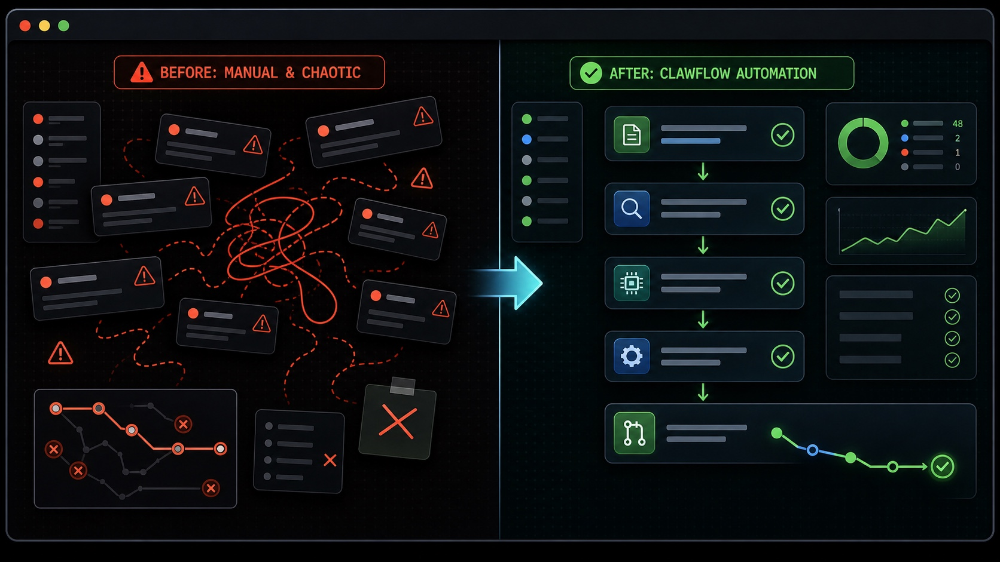
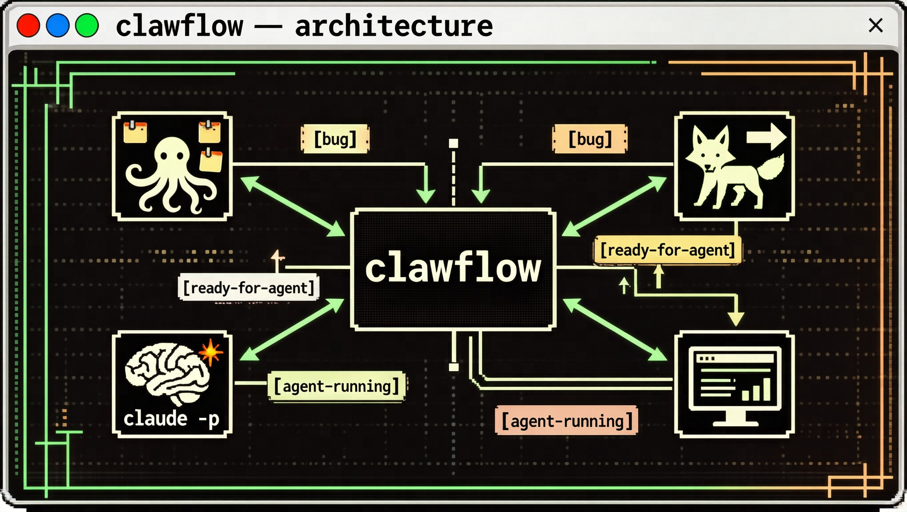
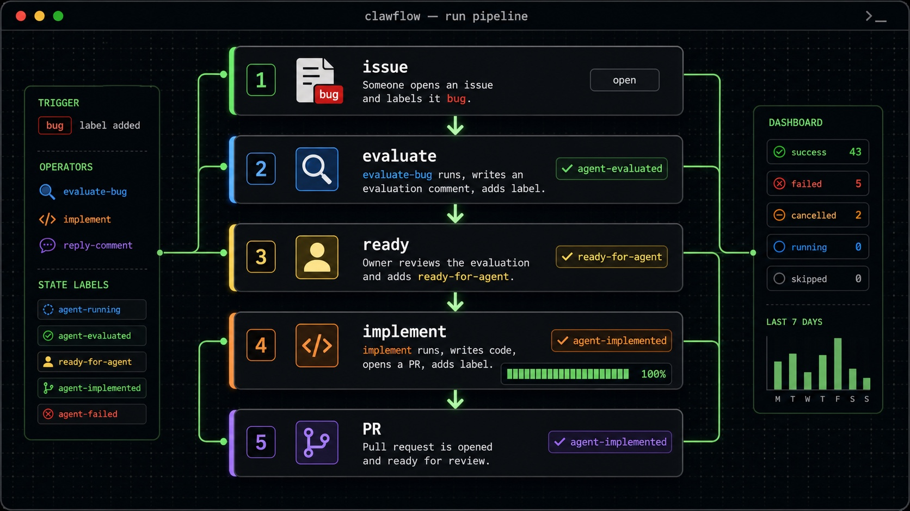

# ClawFlow

> **Automación basada en etiquetas que convierte issues en PRs en GitHub y GitLab.**
>
> ClawFlow consulta los repositorios que configuras, empareja cada issue/PR abierto con un conjunto de **operadores** (archivos `SKILL.md` autocontenidos) y ejecuta el operador coincidente mediante `claude -p`. El estado reside únicamente en las etiquetas y comentarios del VCS: no hay base de datos, ningún backend SaaS ni ningún servicio orquestador. Ejecútalo una vez, ajústalo a un cron, ejecútalo desde tu editor: es el mismo binario en cualquier caso.



El panel local (`clawflow web`) te proporciona una cronología filtrable de cada ejecución de operador en todos los repositorios monitoreados: estado, duración, enlaces a PRs y una reproducción completa del flujo de eventos `claude -p` subyacente para cualquier ejecución anterior.

---

## Por qué ClawFlow



Dos puntos de dolor que el proyecto aborda de frente:

- **Los issues de grandes funciones se estancan.** Un issue de seguimiento explota en una docena de subtareas implícitas que nadie desglosa. El operador `decompose` lo divide en sub-issues nativos de GitHub más una lista de verificación parent; `track-progress` consulta la finalización en cada ejecución y cierra automáticamente el issue padre cuando se completa el último hijo.
- **Desviación de configuración entre máquinas.** Los repos que iste en el portátil de trabajo no existen en el portátil de casa. `clawflow sync push/pull` envía tu `config.yaml` (menos tokens y rutas locales) a través de un GitHub Gist privado — `clawflow login` lo descubre o crea automáticamente. Sin SaaS, sin cuenta adicional.

---

## Instalación

```bash
curl -fsSL https://raw.githubusercontent.com/zhoushoujianwork/clawflow/main/get.sh | bash
```

Soporta macOS (Apple Silicon e Intel) y Linux (x86_64 y arm64). El instalador:

- Descarga el binario correcto para tu plataforma en `~/.clawflow/bin/clawflow`
- Inicializa `~/.clawflow/config/` con una configuración de plantilla
- Añade `~/.clawflow/bin` a tu `PATH` del shell

También necesitas el [Claude Code CLI](https://claude.ai/code) en tu `PATH` — ClawFlow ejecuta `claude -p` en segundo plano para ejecutar operadores.

---

## Configuración

### 1. Almacenar tokens

**GitHub:**
```bash
clawflow config set-token ghp_xxxxxxxxxxxx
```
Ámbitos requeridos: `repo` (completo), `read:org`.

**GitLab:**
```bash
clawflow config set-gitlab-token glpat-xxxxxxxxxxxx
```
Ámbitos requeridos: `api`.

Los tokens se guardan en `~/.clawflow/config/credentials.yaml` (permisos 0600). Las variables de entorno tienen prioridad: `GH_TOKEN`, `GITLAB_TOKEN`.

### 2. Añadir repositorios a monitorear

`repo add` detecta automáticamente la plataforma desde la entrada — no se necesitan banderas en la mayoría de los casos:

```bash
# GitHub — URL, SSH o forma corta
clawflow repo add https://github.com/owner/repo
clawflow repo add git@github.com:owner/repo.git
clawflow repo add owner/repo

# GitLab autoalojado — URL completa (soporta namespaces anidados)
clawflow repo add https://gitlab.company.com/ns/group/repo

# Directorio local — lee automáticamente el origen de `.git/config`
clawflow repo add .
clawflow repo add ~/github/my-repo
```

Anular plataforma o URL de instancia manualmente:
```bash
clawflow repo add ns/repo --platform gitlab --base-url https://gitlab.company.com
```

Gestionar repos:
```bash
clawflow repo list
clawflow repo enable  owner/repo
clawflow repo disable owner/repo
clawflow repo remove  owner/repo
```

### 3. Inicializar etiquetas

Las etiquetas se crean automáticamente en `repo add`. Para (re)crearlas manualmente:

```bash
clawflow label init owner/repo
```

**Etiquetas de activación** — filtran qué operador se ejecuta en un issue:

| Etiqueta | Ejecuta operador |
|---|---|
| `bug` | `evaluate-bug` |
| `feat` | `evaluate-feat` *(planeado, post-MVP)* |
| `ready-for-agent` | `implement` — lo añades manualmente después de revisar la evaluación |
| `agent-mentioned` | `reply-comment` |

**Etiquetas de estado** — escritas por los operadores:

| Etiqueta | Significado |
|---|---|
| `agent-running` | Bloqueo universal de ejecución. Se añade antes de que un operador se ejecute y se quita después (éxito o fallo). |
| `agent-evaluated` | Un operador `evaluate-*` ha publicado su evaluación. Detiene la reevaluación. |
| `agent-skipped` | Confianza demasiado baja: el operador decidió no continuar. |
| `agent-implemented` | `implement` finalizado: el PR está abierto. |
| `agent-failed` | Un operador falló: consulta el comentario de fallo en el issue. |
| `agent-replied` | `reply-comment` ha respondido a la última mención. |

ClawFlow nunca añade `ready-for-agent` por sí mismo: la aprobación del propietario siempre es necesaria para pasar de la evaluación a la implementación.

### 4. Ejecutar

```bash
clawflow run
```

Escanea cada repositorio habilitado una vez, ejecuta los operadores coincidentes y sale. Programalo con cron, launchd o el agente de tu editor: ClawFlow no mantiene un estado a largo plazo.

---

## Cómo funciona



Un único binario CLI, etiquetas y comentarios como único estado compartido, y `claude -p` como motor de ejecución: todo el sistema cabe en un diagrama.

```
clawflow run
  └─ for each configured repo
       └─ list open issues and PRs
            └─ for each one, match its labels against every registered operator
                 └─ on first match:
                      1. add the operator's lock label (concurrency guard)
                      2. invoke `claude -p` with the operator's SKILL.md + issue context
                      3. the operator posts its comment / label / PR
                      4. remove the lock label
```

Sin orquestador, sin sub-agentes, sin DAG. Los operadores solo se coordinan a través de las etiquetas y comentarios que leen y escriben: la salida de un operador se convierte implícitamente en el trigger del siguiente operador.



Ejemplo de flujo de extremo a extremo para un bug:

1. Alguien abre un issue y lo etiqueta con `bug`.
2. La siguiente `clawflow run` — `evaluate-bug` coincide, escribe un comentario de evaluación y añade `agent-evaluated`.
3. El propietario lee la evaluación y añade `ready-for-agent`.
4. La siguiente `clawflow run` — `implement` coincide, crea una rama, escribe código, abre un PR y añade `agent-implemented`.

---

## Arquitectura: Operadores

Un **operador** es un único archivo `SKILL.md` — frontmatter más un prompt — que declara:

- **Trigger**: en qué issues/PRs se ejecuta (tipo de destino + etiquetas requeridas + etiquetas excluidas)
- **Lock label**: la etiqueta usada como mutex por ejecución
- **Body**: el prompt que recibe `claude -p`, con el contexto del issue inyectado

Los operadores residen en dos lugares:

- **Integrado**: `skills/<name>/SKILL.md` dentro de este repositorio — embebido en el binario durante la compilación.
- **Anulaciones de usuario**: `~/.clawflow/skills/<name>/SKILL.md` — el mismo nombre anula el integrado.

Ese es todo el modelo de extensión. Para añadir un nuevo operador, coloca un `SKILL.md` en uno de esos directorios. Sin API de plugin, sin paso de registro.

Consulta [`CLAUDE.md`](CLAUDE.md) para el esquema del frontmatter y los principios de diseño de operadores.

---

## Issues de seguimiento y sub-issues

Para características grandes que abarcan múltiples tareas de implementación, ClawFlow soporta el patrón de **issue de seguimiento** respaldado por la relación nativa de sub-issue de GitHub.

### Cómo funciona

1. Crea un issue y añade la etiqueta `tracking`.
2. Déjalo fluir a través de `classify` → `evaluate-feat` → añade `ready-for-agent`.
3. El operador `decompose` se dispara, lee el cuerpo del issue, crea sub-issues mediante `clawflow issue create` + `clawflow issue add-sub`, y publica un comentario con lista de verificación.
4. Los sub-issues fluyen a través del pipeline normal de forma independiente: `classify` → `evaluate` → `ready-for-agent` → `implement`.
5. Después de cada `clawflow run`, el operador `track-progress` verifica la finalización de los sub-issues mediante `clawflow issue list-sub`. Cuando todos los sub-issues están completados, emite `agent-closed` y ClawFlow cierra el padre automáticamente.

### Etiquetas involucradas

| Etiqueta | Rol |
|---|---|
| `tracking` | Marca el issue padre; evita que `implement` lo toque directamente |
| `agent-decomposed` | Se establece después de que `decompose` crea sub-issues |
| `progress-check` | Trigger efímero para `track-progress`; se reañade en cada ejecución hasta que todos los sub-issues estén listos |
| `agent-watching` | Resultado cuando los sub-issues aún están pendientes |
| `agent-closed` | Resultado final; desencadena el cierre automático del issue padre |

### Comandos CLI

```bash
# Link an existing issue as a sub-issue of a parent
clawflow issue add-sub --repo owner/repo --parent 10 --sub 11

# List all sub-issues of an issue
clawflow issue list-sub --repo owner/repo --issue 10
clawflow issue list-sub --repo owner/repo --issue 10 --json
```

GitLab no tiene una API nativa de sub-issues: `add-sub` y `list-sub` devuelven un error en repos de GitLab. El operador `decompose` aún crea los issues; `track-progress` recurre a analizar la lista de verificación en el cuerpo del issue.

---

## Sincronización de configuración (multi-máquina)

¿Trabajas en múltiples máquinas? `clawflow sync` mantiene tu lista de repos y configuraciones sincronizadas a través de un **GitHub Gist privado** — sin cuenta adicional, sin backend SaaS.

```bash
# 1. Authenticate first (stores token + discovers/creates the Gist)
clawflow login <github-token>

# 2. First machine: push local config to the private Gist
clawflow sync push

# 3. Second machine: authenticate, then pull and merge
clawflow login <github-token>
clawflow sync pull

# Preview the diff before applying
clawflow sync
```

**Qué se sincroniza:**

| Campo | ¿Sincronizado? | Notas |
|---|---|---|
| `repos` | ✅ | Fusión de 1unión: se mantienen los repos de ambos lados |
| `settings.*` | ✅ | Gana la versión en la nube al hacer pull |
| `credentials` | ❌ | Nunca se sincroniza: los tokens permanecen locales |
| `local_path` | ❌ | Específico de la máquina: siempre se conserva la copia local |

El ID del Gist se almacena en `~/.clawflow/config/credentials.yaml` después del primer push. `clawflow login` descubre automáticamente un Gist `clawflow-config` existente si has hecho push desde otra máquina antes.

---

Para proyectos en los que quieres que ClawFlow triaje activamente (no solo reaccione a issues etiquetados), habilita el **Pilot**:

```bash
clawflow project automation enable my-project --cooldown 30
```

O cambia la alternancia en la página de detalles del proyecto del panel.

Cuando está activa, cada pase de `clawflow run` — después de que los operadores terminen — despierta a un Pilot por proyecto (una invocación no interactiva de `claude -p` con raíz en `~/.clawflow/projects/<name>/`). El Pilot tria el backlog en los **bordes** del pipeline de operadores: registrar nuevo trabajo, corregir etiquetas de activación faltantes, cerrar issues obsoletos/duplicados, comentar para explicar decisiones. El centro del pipeline (evaluate → ready-for-agent → implement → merge) sigue siendo propiedad de los operadores + `auto_approve` / `auto_merge` a nivel de repositorio.

#### Archivos de trabajo del Pilot

`~/.clawflow/projects/<name>/` contiene todo el mundo del Pilot:

| Archivo | Propietario | Rol |
|---|---|---|
| `CLAUDE.md` | clawflow (auto-generado) | Cargador de repos miembros. Se actualiza desde `project.yaml` en cada despertar; se carga automáticamente por `claude -p` para que el Pilot siempre sepa qué repos pertenecen y dónde viven localmente. No edites manualmente: tus cambios se sobrescribirán. |
| `context.md` | **el propio Pilot** | La memoria de trabajo en evolución del Pilot. Se lee al iniciar el despertar. El Pilot puede reescribirlo al final del despertar mediante un bloque ` ```context.md ``` ` acotado cuando se aprende algo material. Versionado por el repositorio git a nivel de proyecto. |
| `deployment.md` | tú | Opcional: comandos de recuperación de logs / verificación de estado. Cuando está presente, el Pilot inspecciona los logs antes de triar el backlog (los errores de producción tienen prioridad sobre el trabajo de seguimiento). |
| `testing.md` | tú | Opcional: SOP del entorno local. Usado por el operador `implement`, no por el Pilot. |

#### Con qué despierta el Pilot

El prompt de cada despertar incluye: `context.md` (memoria propia), `deployment.md` (si está presente), las **líneas `PILOT-RESULT` de los últimos 3 despertares** (memoria a corto plazo: impide que el Pilot repita lo que ya hizo) y la instantánea actual del backlog (issues abiertos + PRs en todos los repos miembros).

#### Bucle cerrado

```
clawflow run
  → operators process labeled issues
  → Pilot wakes (cooldown-gated, per project)
      → reads context.md / recent history / live backlog
      → triages: file/label/close/comment (≤2 new issues per wake)
      → optionally rewrites context.md
  → next clawflow run pass executes the changes
```

`--cooldown` (por defecto 30 min) limita los despertares para que un cron rápido no se ejecute en cada pase. Desactívalo con `clawflow project automation disable my-project`.

---

## Estructura de directorios

```
~/.clawflow/                          ← datos del usuario
├── bin/clawflow                      ← binario CLI
├── config/
│   ├── config.yaml                   ← repos a monitorear
│   ├── credentials.yaml              ← tokens (0600)
│   └── install.yaml                  ← registro de instalación
├── projects/                         ← agrupaciones de proyectos multi-repo
│   └── my-project/
│       ├── project.yaml              ← repos miembros + config de automatización
│       ├── CLAUDE.md                 ← cargador de repos del Pilot (auto-generado)
│       ├── context.md                ← memoria en evolución del Pilot (escrito por el Pilot)
│       ├── deployment.md             ← opcional: comandos de log/estado
│       └── testing.md                ← opcional: SOP del entorno local
└── skills/                           ← operadores personalizados del usuario (anulan integrados por nombre)
    └── my-operator/
        └── SKILL.md

clawflow/ (este repo)
├── cmd/clawflow/                     ← código fuente Go CLI
├── internal/
│   ├── config/                       ← análisis y escritura de config
│   ├── operator/                     ← cargador y executor de operadores
│   ├── project/                      ← CRUD de agrupación de proyectos
│   └── vcs/                          ← cliente VCS independiente de la plataforma (GitHub + GitLab)
├── skills/                           ← operadores integrados (embebidos en tiempo de compilación)
│   ├── evaluate-bug/SKILL.md
│   ├── implement/SKILL.md
│   └── reply-comment/SKILL.md
└── agent-skills/                     ← habilidades de agente para herramientas de codificación AI
    └── clawflow/SKILL.md             ← enseña a las herramientas AI la CLI de clawflow
```

---

## Referencia CLI

Los comandos están organizados por categoría. Ejecuta `clawflow <cmd> --help` para ver las banderas.

| Categoría | Comandos |
|---|---|
| **Bucle principal** | `clawflow run` — escanea y ejecuta operadores coincidentes una vez |
| **Operadores** | `clawflow operators list` — muestra qué operadores están registrados (integrados + usuario) |
| **Repos** | `clawflow repo add / remove / list / enable / disable` |
| **Etiquetas** | `clawflow label add / remove / init` |
| **Issues** | `clawflow issue create / list / comment / close` |
| **PRs** | `clawflow pr create / list / view / comment / merge` |
| **Configuración** | `clawflow config set-token / set-gitlab-token / show` |
| **Sincronización** | `clawflow sync` — vista previa de diff · `clawflow sync push` — subir a Gist · `clawflow sync pull` — fusionar desde Gist |
| **Panel** | `clawflow web` — sirve el panel local en http://127.0.0.1:8080 |
| **Actualización** | `clawflow update` — obtiene el último binario |
| **Ayudantes de operadores *(invocados desde cuerpos de SKILL.md)*** | `clawflow worktree` — crea/elimina worktrees git por issue · `clawflow pr-check` — ¿hay un PR abierto para este issue? · `clawflow lang` — detecta comandos de build/test para archivos modificados · `clawflow status` — resumen de estado por repo |

> **Disciplina de herramientas:** dentro de los operadores, usa siempre comandos `clawflow` para acciones VCS, nunca `gh` — consulta `CLAUDE.md` para el rationale.

---

## Panel local (opcional)

Cada `clawflow run` escribe instantáneas JSON y registros de eventos por ejecución en `~/.clawflow/dashboard/`. Inicia la interfaz web con:

```bash
clawflow web --open          # serves http://127.0.0.1:8080 and opens your browser
```

Qué muestra:

- **Panel** — cronología filtrable de ejecuciones recientes de operadores en todos los repos monitoreados, con estado, duración y enlaces a PRs
- **Detalle de ejecución** — reproducción del registro de eventos stream-json completo de `claude -p` (llamadas a herramientas, mensajes del asistente, resultado final) para cualquier ejecución pasada
- **Repos** — vista de solo lectura de todos los repos en `config.yaml` con historial de ejecución por repo
- **Operadores** — todos los operadores integrados y de usuario con triggers, etiquetas lock y descripciones

El panel es una vista de solo lectura de SPA estática (React + Vite + Tailwind) — no llama a la API de GitHub/GitLab por sí misma. Todo el estado proviene de archivos que escribió la CLI. Para actualizar, ejecuta `clawflow run` y recarga la página. El paquete se envía dentro del binario a través de `embed.FS`, por lo que no se requiere una toolchain Node en el momento de la instalación.

Si prefieres no usar `clawflow web`, apunta cualquier servidor de archivos estáticos (`python3 -m http.server`, nginx, …) a `~/.clawflow/dashboard/` — es autocontenido.

---

## Integración con Claude Code (opcional)

Si usas [Claude Code](https://claude.ai/code), instala las habilidades de agente que enseñan a Claude sobre ClawFlow:

```bash
clawflow install-skill
```

Esto instala la habilidad **clawflow** en `~/.claude/skills/`, enseñando a Claude los comandos CLI para operaciones de issue/PR/etiqueta.

Para programación autónoma, usa la automatización por proyecto (`clawflow project automation enable`) en su lugar: se ejecuta dentro de `clawflow run` y no depende de que Claude Code esté abierto.

Ejecute sin flags si solo desea la CLI sin integración de herramientas AI.

---

## Plataformas compatibles

| Plataforma | Estado | Notas |
|---|---|---|
| **GitHub** | ✅ | REST API v3 |
| **GitLab** | ✅ | REST API v4, autoalojado v11.11+ |

> Inicio rápido local: [Empezar con Claude Code](docs/quickstart-claude-code.md)

---

## Actualización

```bash
clawflow update                    # fetch the latest binary
clawflow update --from-source      # rebuild from cloned repo (dev)
```

---

## Contribuir / Expandir

El proyecto es deliberadamente pequeño. Para cambiar el comportamiento, casi siempre querrás editar o añadir un operador, no código Go:

1. Crea `skills/<operator-name>/SKILL.md` (integrado) o `~/.clawflow/skills/<operator-name>/SKILL.md` (usuario).
2. Declara el frontmatter: `name`, `description`, `operator.trigger`, `operator.lock_label`.
3. Escribe el cuerpo del prompt.
4. Ejecuta `clawflow operators list` para confirmar que está registrado, luego `clawflow run` para probarlo en un issue de prueba.

El trabajo CLI de Go va bajo `cmd/clawflow/commands/` e `internal/`. El punto crítico a modificar para expandir el bucle en sí es `internal/operator/`.

---

## Licencia

MIT
